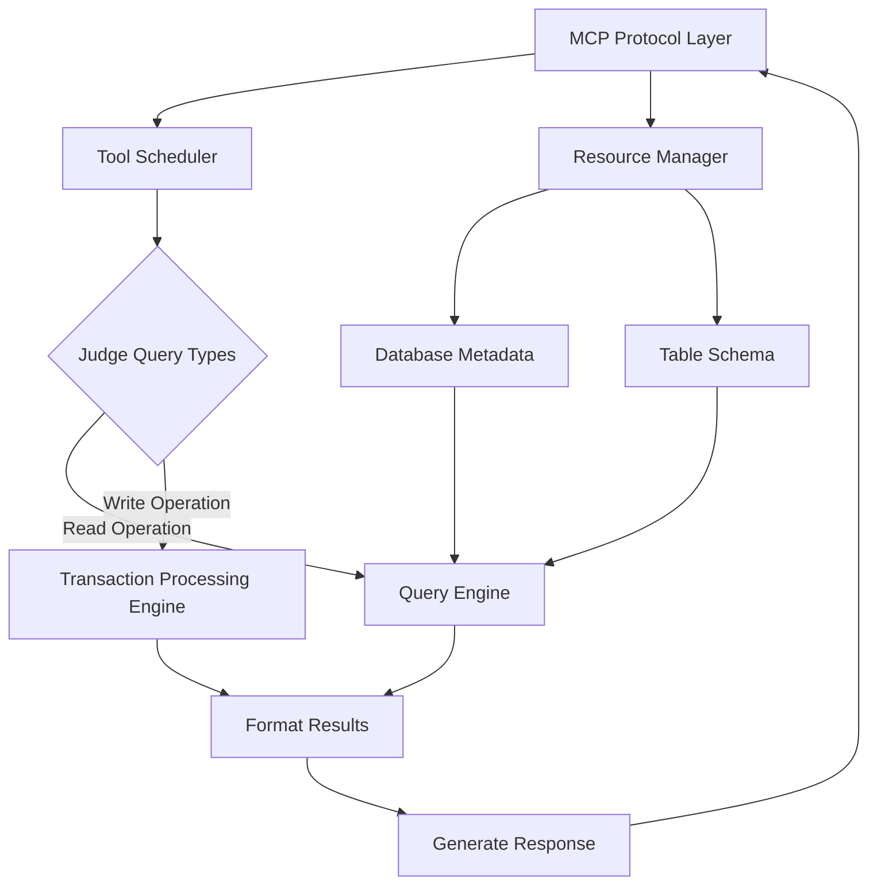
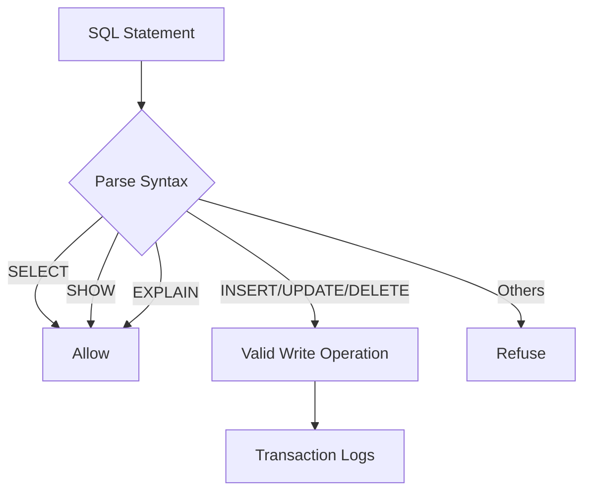

# KWDB MCP Server

[中文版](README_zh.md)

## Overview

The KWDB MCP Server is a server implementation based on the [MCP](https://modelcontextprotocol.io/introduction) (Model Context Protocol) protocol, which provides a set of tools and resources for interacting with the KWDB database and providing business intelligence functionality through the MCP protocol. The KWDB MCP Server supports reading, writing, querying, modifying data, and performing DDL operations.

### Architecture

The core process of the KWDB MCP Server consists of the following components:

- Parse MCP protocol: deal with MCP StdIO or HTTP SSE requests.
- Schedule MCP Tools: distribute API requests based on the types of MCP Tools.
- Prepare queries: automatically add the `LIMIT 20` clause for SQL queries without a `LIMIT` clause.
- Format query results: adopt a consistent JSON format for all API responses.



### Features

- **Read Operations**: execute `SELECT`, `SHOW`, `EXPLAIN`, and other read-only queries.
- **Write Operations**: execute `INSERT`, `UPDATE`, `DELETE`, and `CREATE`, `DROP`, `ALTER` DDL operations.
- **Database Information**: get information about the database, including tables and their schemas.
- **Syntax Guide**: access a comprehensive syntax guide for KWDB through Prompts.
- **Standard API Response**: provide a consistent JSON structure for all API responses.
    ```json
    {
      "status": "success",  // or "error"
      "type": "query_result",  // response type
      "data": { ... },  // response data
      "error": null  // errors, if successful, it is set to null
    }
    ```
- **Automatic LIMIT**: prevent large result sets by automatically adding the `LIMIT 20` clause to `SELECT` queries without a `LIMIT` clause.

### Security

The KWDB MCP Server provides the following security measures:

- Provide separate tools for read and write operations.
- Valid queries to ensure that they match the expected operation type.
- Print clear error messages for unauthorized operations.



### MCP Resources

MCP Resources allow the KWDB MCP Server to expose data and content that can be read by MCP clients and used as context for LLM interactions. The KWDB MCP Server provides the following MCP Resources:

| Resources           | URI Format                       | Description                                                                            | Example                     |
|---------------------|----------------------------------|----------------------------------------------------------------------------------------|-----------------------------|
| Product information | `kwdb://product_info`            | Product information, including the version and supported features                      | `kwdb://product_info/`      |
| Database metadata   | `kwdb://db_info/{database_name}` | Information about a specific database, including the engine type, comments, and tables | `kwdb://db_info/db_shig`    |
| Table schema        | `kwdb://table/{table_name}`      | Schema of a specific table, including columns and example queries                      | `kwdb://table/user_profile` |

### MCP Tools

The MCP Tools enable the KWDB MCP Server to expose executable functionality to MCP clients. Through MCP Tools, LLMs can interact with external systems. The KWDB MCP Server provides the following MCP Tools.

#### read-query

The KWDB MCP Server executes the `SELECT`, `SHOW`, `EXPLAIN` statements, and other read-only queries to read data from the database. The `read_query` function returns the query results in a format of array for your SQL statement. In addition, the KWDB MCP Server will automatically add the `LIMIT 20` clause to `SELECT` queries without a `LIMIT` clause to prevent large result sets.

Examples:

```sql
-- Query table data.
SELECT * FROM users LIMIT 10;

-- List all created tables.
SHOW TABLES;

-- Execute a SQL query and generate details about the SQL query.
EXPLAIN ANALYZE SELECT * FROM orders WHERE user_id = 1;
```

#### write-query

The KWDB MCP Server executes data modification queries, including DML and DDL operations.

Examples:

```sql
-- Insert data into the table.
INSERT INTO users (name, email) VALUES ('John Doe', 'john@example.com');

-- Update data in the table.
UPDATE users SET email = 'new-email@example.com' WHERE id = 1;

-- Remove data from the table.
DELETE FROM users WHERE id = 1;

-- Create a table.
CREATE TABLE products (id SERIAL PRIMARY KEY, name TEXT, price DECIMAL);

-- Add a column to a table.
ALTER TABLE products ADD COLUMN description TEXT;

-- Remove a table.
DROP TABLE products;
```

### MCP Prompts

MCP Prompts enable the KWDB MCP Server to define reusable prompt templates and workflows that MCP clients can easily surface to users and LLMs. They provide a powerful way to standardize and share common LLM interactions. The KWDB MCP Server provides the following MCP Prompts:

| Type                 | Prompt Name          | Description                                                                                                          |
|----------------------|----------------------|----------------------------------------------------------------------------------------------------------------------|
| Database description | `db_description`     | A comprehensive description of KWDB database, including core functions, supported features, and use cases.           |
| Syntax guide         | `syntax_guide`       | A comprehensive syntax guide for KWDB, including examples of common queries and best practices.                      |
| Cluster management   | `cluster_management` | A comprehensive guide for managing KWDB clusters, including node management, load balancing, and monitoring.         |
| Data migration       | `data_migration`     | A guide for migrating data to and from KWDB, including import/export methods and best practices.                     |
| Installation         | `installation`       | A step-by-step guide for installing and deploying KWDB in various environments.                                      |
| Performance tunning  | `performance_tuning` | A guide for optimizing KWDB performance, including query optimization, indexing strategies, and system-level tuning. |
| Troubleshooting      | `troubleshooting`    | A guide for diagnosing and resolving common KWDB issues and errors.                                                  |
| Backup and restore   | `backup_restore`     | A comprehensive guide for backing up and restoring KWDB databases, including strategies, tools, and best practices.  |
| DBA templates        | `dba_template`       | Templates and guidelines for MCP Prompts writing.                                                                    |

#### Add MCP Prompts

The MCP Prompts are Markdown files stored in the `pkg/prompts/docs/` directory. These files are embedded into the binary when compiling the KWDB MCP Server using Go's `embed` package. Currently, the KWDB MCP Server provides the following Prompts files:

- `pkg/prompts/docs/ReadExamples.md`: contain read query examples (using the `SELECT` statement).
- `pkg/prompts/docs/WriteExamples.md`: contain write query examples (using the `INSERT`, `UPDATE`, `DELETE`, `CREATE`, `ALTER` statements).
- `pkg/prompts/docs/DBDescription.md`: contain the database description.
- `pkg/prompts/docs/SyntaxGuide.md`: contain the SQL syntax guide.
- `pkg/prompts/docs/ClusterManagementGuide.md`: contain the cluster management guide.
- `pkg/prompts/docs/DataMigrationGuide.md`: contain the data migration guide.
- `pkg/prompts/docs/InstallationGuide.md`: contain the installation guide.
- `pkg/prompts/docs/PerformanceTuningGuide.md`: contain the performance tuning guide.
- `pkg/prompts/docs/TroubleShootingGuide.md`: contain the troubleshooting guide.
- `pkg/prompts/docs/BackupRestoreGuide.md`: contain the backup and restore guide.
- `pkg/prompts/docs/DBATemplate.md`: contain the database administration template.

To add MCP Prompts, follow these steps:

1. Create a Markdown file in the `pkg/prompts/docs/` directory, such as `new_usecase.md`.
2. Add the variable and load codes in the [`pkg/prompts/prompts.go`](./pkg/prompts/prompts.go) file.
3. Create a registration function for the new MCP Prompts.
4. Add the registration function call to `registerUseCasePrompts()` in the [`pkg/prompts/prompts.go`](./pkg/prompts/prompts.go) file.
5. Update the `README` file.

For details about how to add MCP Prompts, see comments in the [`pkg/prompts/prompts.go`](./pkg/prompts/prompts.go) file.

#### Modify MCP Prompts

To modify MCP Prompts, follow these steps:

1. Edit the specific Markdown file(s) in the `pkg/prompts/docs/` directory.
2. Run the `make build` command to rebuild the application. The updated MCP Prompts will be embedded in the binary.

## Build From Source Code

### Prerequisites

- Install Go 1.23 or higher.
- Download and install PostgreSQL Driver `lib/pq`.
- Install and start KWDB, configure the authentication method, and create a database. For details, see the [KWDB Documentation Website](https://www.kaiwudb.com/kaiwudb_docs/#/oss_dev/deployment/overview.html).
- Create a user with appropriate privileges on tables and databases. For details, see [Create Users](https://www.kaiwudb.com/kaiwudb_docs/#/oss_dev/deployment/bare-metal/user-config-bare-metal.html).

### Steps

1. Clone the repository.

    ```shell
    git clone https://gitee.com/kwdb/kwdb-mcp-server
    cd kwdb-mcp-server
    ```

2. Install dependencies.

    ```shell
    make deps
    ```

3. Build the application.

    ```shell
    make build
    ```

If you succeed, the application adopts the following structure.

```plain
mcp-kwdb-server-go/
├── bin/
│   └── kwdb-mcp-server      # Binary executable file
├── cmd/
│   └── kwdb-mcp-server/
│       └── main.go           # The main application
├── pkg/
│   ├── db/
│   │   └── db.go             # Database operations
│   ├── prompts/
│   │   ├── prompts.go        # MCP Prompts
│   │   └── docs/             # MCP Prompts files
│   │       ├── ReadExamples.md     # Read query examples
│   │       ├── WriteExamples.md    # Write query examples
│   │       ├── DBDescription.md    # Database descriptions
│   │       ├── SyntaxGuide.md      # SQL Syntax guide
│   │       ├── ClusterManagementGuide.md # Cluster management guide
│   │       ├── DataMigrationGuide.md    # Data migration guide
│   │       ├── InstallationGuide.md      # Installation guide
│   │       ├── PerformanceTuningGuide.md # Performance tunning
│   │       ├── TroubleShootingGuide.md   # Troubleshooting guide
│   │       ├── BackupRestoreGuide.md     # Backup and restore guide
│   │       └── DBATemplate.md            # DBA templates
│   ├── resources/
│   │   └── resources.go      # MCP Resources
│   ├── server/
│   │   └── server.go         # KWDB MCP Server configurations
│   ├── tools/
│   │   └── tools.go          # MCP Tools
│   └── version/
│       └── version.go        # Version information
├── Makefile                  # Commands for building and running the KWDB MCP Server
└── README.md                 # README file
```

### Start KWDB MCP Server

The KWDB MCP Server supports the following two transport modes:

- StdIO (Standard Input/Output) mode: the KWDB MCP Server uses the standard input/output for communication. This is the default mode.

- SSE (Server-Sent Events) mode: the KWDB MCP Server uses HTTP POST for communication between the server and the client.

#### StdIO Mode

- Run the KWDB MCP Server with a PostgreSQL connection string:

    ```shell
    ./bin/kwdb-mcp-server "postgresql://<username>:<password>@<hostname>:<port>/<database_name>?sslmode=disable"
    ```

- Run the KWDB MCP Server using the Makefile:

    ```shell
    CONNECTION_STRING="postgresql://<username>:<password>@<hostname>:<port>/<database_name>?sslmode=disable" make run
    ```

Parameters:

- `username`: the username used to connect to the KWDB database
- `password`: the password for the username
- `hostname`: the IP address of the KWDB database
- `port`: the port of the KWDB database
- `database_name`: the name of the KWDB database
- `sslmode`: the SSL mode, available options are `disable`, `allow`, `prefer`, `require`, `verify-ca` and `verify-full`. For details about the SSL mode, see [SSL Mode Parameters](https://www.kaiwudb.com/kaiwudb_docs/#/oss_dev/development/connect-kaiwudb/java/connect-jdbc.html#%E8%BF%9E%E6%8E%A5%E5%8F%82%E6%95%B0).

#### SSE Mode

To access KWDB databases deployed on other servers, you can start the KWDB MCP Server in SSE mode.

> **Note**
>
> You need to provide the database connection string as the last parameter.

- Run the KWDB MCP Server with a PostgreSQL connection string:

    ```shell
    ./bin/kwdb-mcp-server -t sse -addr ":8080" -base-url "http://localhost:8080" "postgresql://<username>:<password>@<hostname>:<port>/<database_name>?sslmode=disable"
    ```

- Run the KWDB MCP Server using the Makefile:

    ```shell
    CONNECTION_STRING="postgresql://<username>:<password>@<hostname>:<port>/<database_name>?sslmode=disable" ADDR=":8080" BASE_URL="http://localhost:8080" make run -sse
    ```

Parameters:

- `-t` or `-transport`: the transport type, available options are `stdio` or `sse`.
  - `stdio`: the StdIO mode
  - `sse`: the SSE mode
- `-addr` or `ADDR`: the listening port of the KWDB MCP Server. By default, it is set to `:8080`.
- `-base-url` or `BASE_URL`: the IP address of the KWDB MCP Server. By default, it is set to `http://localhost:8080`.
- `username`: the username used to connect to the KWDB database
- `password`: the password for the username
- `hostname`: the IP address of the KWDB database
- `port`: the port of the KWDB database
- `database_name`: the name of the KWDB database
- `sslmode`: the SSL mode, available options are `disable`, `allow`, `prefer`, `require`, `verify-ca` and `verify-full`. For details about the SSL mode, see [SSL Mode Parameters](https://www.kaiwudb.com/kaiwudb_docs/#/oss_dev/development/connect-kaiwudb/java/connect-jdbc.html#%E8%BF%9E%E6%8E%A5%E5%8F%82%E6%95%B0).

## Integrate with LLM Agents

For details about how the KWDB MCP Server integerates with LLM Agents, see [Integrate with LLM Agents](./docs/integrate-llm-agent_en.md).

## Troubleshooting

For details about how to troubleshoot the KWDB MCP Server, see [Troubleshooting](./docs/troubleshooting_en.md).

## Documentation

For documentation about the KWDB MCP Server, see the [KWDB Documentation Website](https://www.kaiwudb.com/kaiwudb_docs/#/oss_dev/development/connect-kaiwudb/kwdb-mcp-server/connect-kwdb-mcp-server.html).

## Future Enhancements

- [ ] **Query history**: implement query history functionality.
- [x] **Remote mode**: support connecting to the remote KWDB MCP Server.
- [x] **Improved optimization suggestions**: enhance query optimization recommendations.
- [ ] **Metrics resource**: aAdd database metrics.

## Contribution

Contributions are welcome! Please feel free to submit issues and pull requests.

## License

This project is licensed under the MIT License.

## Acknowledgements

- [mark3labs/mcp-go](https://github.com/mark3labs/mcp-go) - MCP Go server framework
- [lib/pq](https://github.com/lib/pq) - PostgreSQL Go driver
