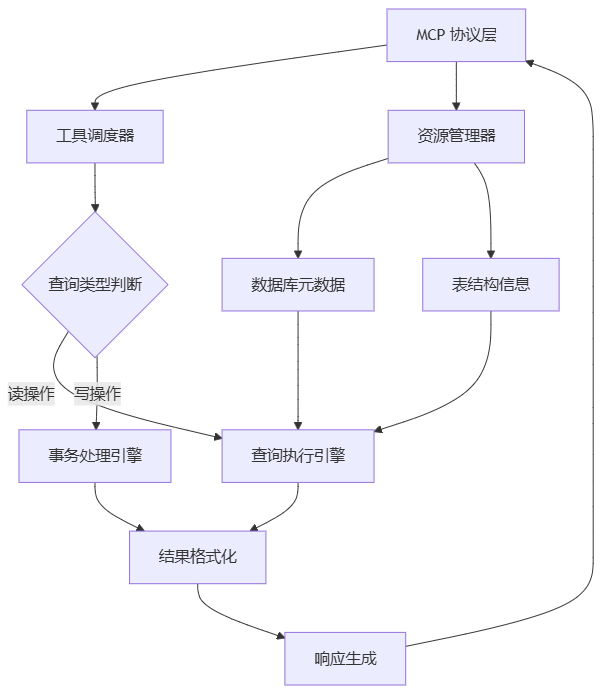
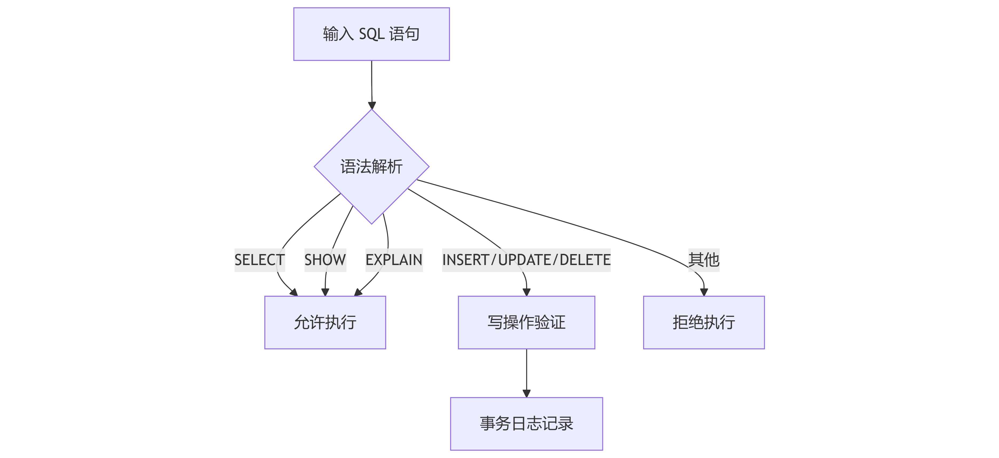

# KWDB MCP Server

## 概述

KWDB MCP Server 是一个基于 [MCP](https://modelcontextprotocol.io/introduction)（Model Context Protocol，模型上下文协议）协议的服务器实现，它通过 MCP 协议提供一套工具和资源，用于与 KWDB 数据库交互和提供商业智能功能。KWDB MCP Server 支持读取、写入、查询、修改数据以及执行 DDL 操作。

### 架构设计

KWDB MCP Server 的核心流程包括以下几个部分：

- 协议解析：处理 MCP 标准输入或 HTTP SSE 请求。
- 工具路由：根据工具类型（read/write）分发处理请求。
- 查询预处理：自动添加 `LIMIT` 语法检查。
- 结果封装：采用统一 JSON 响应格式。



### 功能特性

- **读取操作**：支持 `SELECT`、`SHOW`、`EXPLAIN` 和其他只读查询。
- **写入操作**：支持 `INSERT`、`UPDATE`、`DELETE` DML 操作和 `CREATE`、`DROP`、`ALTER` DDL 操作。
- **数据库信息**：获取数据库信息，包括数据库中所有的表及其架构。
- **语法指南**：根据提示，访问 KWDB 支持的综合 SQL 语法指南。
- **标准化 API 响应**：所有 API 响应遵循一致的 JSON 结构。
    ```json
    {
      "status": "success",  // 或 "error"
      "type": "query_result",  // 响应类型
      "data": { ... },  // 响应数据
      "error": null  // 错误信息，成功时为 null
    }
    ```
- **自动 LIMIT**：自动为没有 `LIMIT` 子句的 `SELECT` 查询语句添加 `LIMIT 20` 子句， 防止生成大型结果集。

### 安全性

KWDB MCP Server 实现以下安全性能。

- 提供单独的读取和写入操作工具。
- 验证查询结果，确保与预期的操作类型匹配。
- 输出未授权操作的错误消息。



### MCP Resources

MCP Resources 指 KWDB MCP Server 暴露的数据和内容，供 MCP 客户端读取并作为 LLM 上下文。下表列出 KWDB MCP Server 支持的 Resources。

| Resources      | URI 格式                         | 说明                                    | 示例                        |
|----------------|----------------------------------|---------------------------------------|-----------------------------|
| 数据库产品信息 | `kwdb://product_info`            | 数据库产品信息，包括版本和功能。          | `kwdb://product_info/`      |
| 数据库元信息   | `kwdb://db_info/{database_name}` | 目标数据库的信息，包括引擎类型、注释和表。 | `kwdb://db_info/db_shig`    |
| 表结构信息     | `kwdb://table/{table_name}`      | 目标表的架构，包括列和示例查询。          | `kwdb://table/user_profile` |

### MCP Tools

MCP Tools 指 KWDB MCP Server 暴露的可执行功能，供 LLM 调用以与外部系统交互。KWDB MCP Server 提供以下 Tools。

#### 读查询（read-query）

KWDB MCP Server 支持执行 `SELECT`、`SHOW`、`EXPLAIN` 和其他只读查询，从数据库中读取数据。用户只需要提供一个 SQL 查询语句作为输入，`read_query` 函数就会返回查询结果，结果以对象数组的形式呈现。此外，KWDB MCP Server 也支持为没有 `LIMIT` 子句的 `SELECT` 查询自动添加 `LIMIT 20`，避免生成大型结果集。

示例：

```sql
-- 查看表数据。
SELECT * FROM users LIMIT 10;
-- 查看数据库中已创建的表。
SHOW TABLES;
-- 执行 SQL 查询，生成包含查询详细信息的文件。
EXPLAIN ANALYZE SELECT * FROM orders WHERE user_id = 1;
```

#### 写查询（write-query）

KWDB MCP Server 支持执行数据修改查询，包括 DML 和 DDL 操作。

示例：

```sql
-- 插入数据。
INSERT INTO users (name, email) VALUES ('John Doe', 'john@example.com');
-- 更新数据。
UPDATE users SET email = 'new-email@example.com' WHERE id = 1;
-- 删除数据。
DELETE FROM users WHERE id = 1;
-- 创建表。
CREATE TABLE products (id SERIAL PRIMARY KEY, name TEXT, price DECIMAL);
-- 修改表。
ALTER TABLE products ADD COLUMN description TEXT;
-- 删除表
DROP TABLE products;
```

### MCP Prompts

MCP Prompts 指 KWDB MCP Server 定义的可复用提示模板，引导 LLM 交互。下表列出 KWDB MCP Server 支持的 Prompts。

| 类别       | Prompts              | 描述                                                              |
|----------|----------------------|-----------------------------------------------------------------|
| 数据库描述 | `db_description`     | KWDB 数据库的综合描述，包括其功能、特性和用例。                      |
| 语法指南   | `syntax_guide`       | KWDB 的综合语法指南，包括常见查询示例和最佳实践。                   |
| 集群管理   | `cluster_management` | KWDB 集群管理的综合指南，包括节点管理、负载均衡和监控。              |
| 数据迁移   | `data_migration`     | 数据迁移到 KWDB 和从 KWDB 迁移的指南，包括导入/导出方法和最佳实践。 |
| 安装部署   | `installation`       | 在各种环境中安装和部署 KWDB 的分步指南。                           |
| 性能调优   | `performance_tuning` | 优化 KWDB 性能的指南，包括查询优化、索引策略和系统级调优。           |
| 故障排查   | `troubleshooting`    | 诊断和解决常见 KWDB 问题和错误的指南。                             |
| 备份与恢复 | `backup_restore`     | 备份和恢复 KWDB 数据库的综合指南，包括策略、工具和最佳实践。         |
| DBA 模板   | `dba_template`       | 提示词编写模板。                                                   |

#### 新增 MCP Prompts

MCP Prompts 以 Markdown 文件的形式存储在 `pkg/prompts/docs/` 目录。编译 KWDB MCP Server 时，可以使用 Go 的 `embed` 包将这些 Markdown 文件嵌入到二进制文件中。目前，KWDB MCP Server 提供以下 MCP Prompts 文件：

- `pkg/prompts/docs/ReadExamples.md`：包含读取查询示例（`SELECT` 语句）。
- `pkg/prompts/docs/WriteExamples.md`：包含写入查询示例（`INSERT`、`UPDATE`、`DELETE`、`CREATE`、`ALTER`）。
- `pkg/prompts/docs/DBDescription.md`：包含数据库描述。
- `pkg/prompts/docs/SyntaxGuide.md`：包含 SQL 语法指南。
- `pkg/prompts/docs/ClusterManagementGuide.md`：包含集群管理指南。
- `pkg/prompts/docs/DataMigrationGuide.md`：包含数据迁移指南。
- `pkg/prompts/docs/InstallationGuide.md`：包含安装指南。
- `pkg/prompts/docs/PerformanceTuningGuide.md`：包含性能调优指南。
- `pkg/prompts/docs/TroubleShootingGuide.md`：包含故障排除指南。
- `pkg/prompts/docs/BackupRestoreGuide.md`：包含备份和恢复指南。
- `pkg/prompts/docs/DBATemplate.md`：包含数据库管理模板。

如需新增 MCP Prompts，遵循以下步骤：

1. 在 `pkg/prompts/docs/` 目录中创建一个新的 Markdown 文件，例如 `NewUseCase.md`。
2. 在 [`pkg/prompts/prompts.go`](./pkg/prompts/prompts.go) 文件中，添加变量和加载代码。
3. 为新 Prompts 创建注册函数。
4. 在 [`pkg/prompts/prompts.go`](./pkg/prompts/prompts.go) 文件中，将注册函数调用添加到 `registerUseCasePrompts()`。
5. 更新 `README` 文档。

有关详细信息，参见 [`pkg/prompts/prompts.go`](./pkg/prompts/prompts.go) 中的注释信息。

#### 修改 MCP Prompts

如需修改 MCP Prompts，遵循以下步骤：

1. 编辑 `pkg/prompts/docs/` 目录中相应的 Markdown 文件。
2. 运行 `make build` 命令，重新构建应用程序。将更新的 MCP Prompts 嵌入到二进制文件中。

## 源码编译

### 前提条件

- 已安装 Go 1.23 或更高版本。
- 已下载并安装 PostgreSQL 数据库驱动 `lib/pq`。
- 已安装和运行 KWDB 数据库、配置数据库认证方式、创建数据库。有关详细信息，参见 [KWDB 文档官网](https://www.kaiwudb.com/kaiwudb_docs/#/oss_dev/deployment/overview.html)。
- 已创建具有表级别及以上操作权限的用户。有关详细信息，参见[创建用户](https://www.kaiwudb.com/kaiwudb_docs/#/oss_dev/deployment/bare-metal/user-config-bare-metal.html)。

### 安装部署

1. 克隆仓库。

    ```shell
    git clone https://gitee.com/kwdb/kwdb-mcp-server
    cd kwdb-mcp-server
    ```

2. 安装依赖。

    ```shell
    make deps
    ```

3. 构建应用。

    ```shell
    make build
    ```

编译和安装成功后的文件清单如下：

```plain
kwdb-mcp-server/
├── bin/
│   └── kwdb-mcp-server      # 二进制可执行文件
├── cmd/
│   └── kwdb-mcp-server/
│       └── main.go           # 主应用入口点
├── pkg/
│   ├── db/
│   │   └── db.go             # 数据库操作
│   ├── prompts/
│   │   ├── prompts.go        # MCP 提示词
│   │   └── docs/             # 提示的 Markdown 文件
│   │       ├── ReadExamples.md     # 读取查询示例
│   │       ├── WriteExamples.md    # 写入查询示例
│   │       ├── DBDescription.md    # 数据库描述
│   │       ├── SyntaxGuide.md      # SQL 语法指南
│   │       ├── ClusterManagementGuide.md # 集群管理指南
│   │       ├── DataMigrationGuide.md    # 数据迁移指南
│   │       ├── InstallationGuide.md      # 安装指南
│   │       ├── PerformanceTuningGuide.md # 性能调优指南
│   │       ├── TroubleShootingGuide.md   # 故障排除指南
│   │       ├── BackupRestoreGuide.md     # 备份和恢复指南
│   │       └── DBATemplate.md            # 数据库管理模板
│   ├── resources/
│   │   └── resources.go      # MCP 资源
│   ├── server/
│   │   └── server.go         # 服务器设置
│   ├── tools/
│   │   └── tools.go          # MCP 工具
│   └── version/
│       └── version.go        # 版本信息
├── Makefile                  # 构建和运行命令
└── README.md                 # 本文件
```

### 启动 KWDB MCP Server

KWDB MCP Server 支持以下三种传输机制：

- **标准输入/输出模式（stdio）**：使用标准输入/输出进行通信，适用于本地进程。默认情况下，KWDB MCP Server 采用标准输入/输出模式。
- **SSE（Server-Sent Events，服务器发送事件）模式（sse）**：使用 HTTP SSE 协议进行服务器到客户端的消息推送。
- **HTTP（streamable-http）模式（http）**：推荐模式，基于 MCP 官方 streamable-http 协议，支持标准 HTTP 通信。

#### 标准输入/输出模式

- 使用 PostgreSQL 连接字符串运行 KWDB MCP Server：

    ```shell
    ./bin/kwdb-mcp-server "postgresql://<username>:<password>@<hostname>:<port>/<database_name>?sslmode=disable"
    ```

- 使用 Makefile 运行 KWDB MCP Server：

    ```shell
    CONNECTION_STRING="postgresql://<username>:<password>@<hostname>:<port>/<database_name>?sslmode=disable" make run
    ```
参数说明：
- `username`：连接 KWDB 数据库的用户名。
- `password`：身份验证时使用的密码。
- `hostname`：KWDB 数据库的 IP 地址。
- `port`：KWDB 数据库的连接端口。
- `database_name`：需要访问的 KWDB 数据库名称。
- `sslmode`：SSL 模式。支持的取值包括 `disable`、`allow`、`prefer`、`require`、`verify-ca` 和 `verify-full`。有关 SSL 模式相关的详细信息，参见 [SSL 模式参数]
(https://www.kaiwudb.com/kaiwudb_docs/#/oss_dev/development/connect-kaiwudb/java/connect-jdbc.html#%E8%BF%9E%E6%8E%A5%E5%8F%82%E6%95%B0)。

#### HTTP 模式（推荐）

- 使用 HTTP 模式运行 KWDB MCP Server（监听 8080 端口）：

    ```shell
    ./bin/kwdb-mcp-server -t http -p 8080 "postgresql://<username>:<password>@<hostname>:<port>/<database_name>?sslmode=disable"
    ```

- 使用 Makefile 运行 HTTP 模式：

    ```shell
    CONNECTION_STRING="postgresql://<username>:<password>@<hostname>:<port>/<database_name>?sslmode=disable" PORT=8080 make run-http
    ```

- HTTP 服务默认监听 `0.0.0.0:<port>`，MCP 端点为 `http://<host>:<port>/mcp`
参数说明：

- `-t` 或 `--transport`：传输类型，支持 `stdio`、`sse`、`http`。
  - `stdio`：标准输入/输出模式
  - `sse`：SSE 模式（即将弃用）
  - `http`：HTTP 模式（推荐）
- `-p` 或 `--port`：KWDB MCP Server 的监听端口，默认为 `8080`。
- `username`：连接 KWDB 数据库的用户名。
- `password`：身份验证时使用的密码。
- `hostname`：KWDB 数据库的 IP 地址。
- `port`：KWDB 数据库的连接端口。
- `database_name`：需要访问的 KWDB 数据库名称。
- `sslmode`：SSL 模式。支持的取值包括 `disable`、`allow`、`prefer`、`require`、`verify-ca` 和 `verify-full`。有关 SSL 模式相关的详细信息，参见 [SSL 模式参数](https://www.kaiwudb.com/kaiwudb_docs/#/oss_dev/development/connect-kaiwudb/java/connect-jdbc.html#%E8%BF%9E%E6%8E%A5%E5%8F%82%E6%95%B0)。

#### SSE 模式（即将弃用）

> **说明**
>
> SSE 模式将在未来版本中移除，建议尽快切换到 http 模式。

- 使用 SSE 模式运行 KWDB MCP Server（监听 8080 端口）：

    ```shell
    ./bin/kwdb-mcp-server -t sse -p 8080 "postgresql://<username>:<password>@<hostname>:<port>/<database_name>?sslmode=disable"
    ```

- 使用 Makefile 运行 SSE 模式：

    ```shell
    CONNECTION_STRING="postgresql://<username>:<password>@<hostname>:<port>/<database_name>?sslmode=disable" PORT=8080 make run-sse
    ```

- SSE 服务默认监听 `0.0.0.0:<port>`，SSE 端点为 `http://<host>:<port>/sse`

参数说明：

- `-t` 或 `--transport`：传输类型，支持 `stdio`、`sse`、`http`。
  - `stdio`：标准输入/输出模式
  - `sse`：SSE 模式（即将弃用）
  - `http`：HTTP 模式（推荐）
- `-p` 或 `--port`：KWDB MCP Server 的监听端口，默认为 `8080`。
- `username`：连接 KWDB 数据库的用户名。
- `password`：身份验证时使用的密码。
- `hostname`：KWDB 数据库的 IP 地址。
- `port`：KWDB 数据库的连接端口。
- `database_name`：需要访问的 KWDB 数据库名称。
- `sslmode`：SSL 模式。支持的取值包括 `disable`、`allow`、`prefer`、`require`、`verify-ca` 和 `verify-full`。有关 SSL 模式相关的详细信息，参见 [SSL 模式参数](https://www.kaiwudb.com/kaiwudb_docs/#/oss_dev/development/connect-kaiwudb/java/connect-jdbc.html#%E8%BF%9E%E6%8E%A5%E5%8F%82%E6%95%B0)。

## 集成 LLM Agent

有关 KWDB MCP Server 如何集成 LLM Agent 的详细信息，参见[集成 LLM Agent](./docs/integrate-llm-agent.md)。

## 故障排查

有关如何排查 KWDB MCP Server 故障的详细信息，参见[故障排查](./docs/troubleshooting.md)。

## 文档

有关 KWDB MCP Server 的相关文档，参见 [KWDB 文档官网](https://www.kaiwudb.com/kaiwudb_docs/#/oss_dev/development/connect-kaiwudb/kwdb-mcp-server/connect-kwdb-mcp-server.html)。

## 未来增强

- [ ] **查询历史**：实现查询历史功能
- [x] **远程模式**：支持连接到远程 KWDB MCP Server
- [x] **改进的优化建议**：增强查询优化建议
- [ ] **指标资源**：添加数据库指标信息

## 贡献

欢迎贡献！请随时提交 Issue 和 PR。

## 许可证

本项目根据 MIT 许可证授权。

## 致谢

- [mark3labs/mcp-go](https://github.com/mark3labs/mcp-go) - MCP Go 服务器框架
- [lib/pq](https://github.com/lib/pq) - PostgreSQL Go 驱动程序
