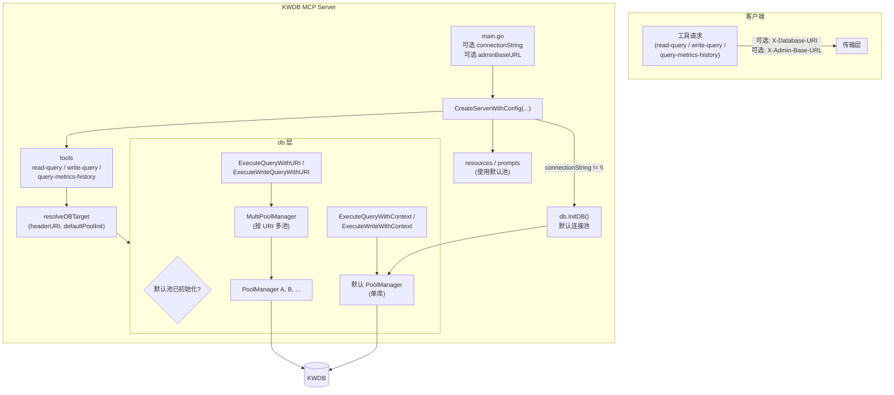
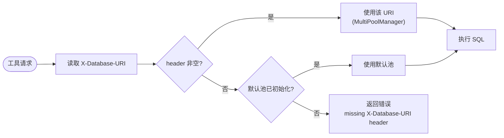
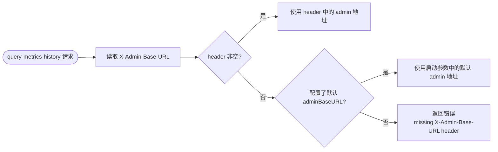
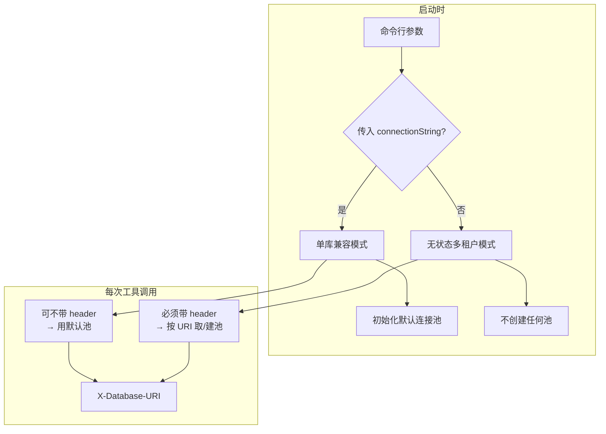

# 双模式与无状态多租户设计说明

本文档描述 KWDB MCP Server 的**双模式**行为、**无状态多租户**设计，以及 admin HTTP 端点默认值的传递方式，便于 Code Review 与后续维护时对齐实现与文档。

---

## 1. 目标与约束

### 1.1 目标

- **无状态多租户**：去掉启动时必传的数据库 URI，通过每次工具调用时的 **`X-Database-URI`** 请求头选择数据库，实现一个 server 进程服务多用户、多库。
- **兼容老产品**：保留“启动参数带 connection string”的用法，现有单库部署方式无需改动即可继续使用。
- **历史指标查询**：通过 `query-metrics-history` 封装数据库 admin `/ts/query` API，并支持默认 admin 地址与每次请求覆盖。

### 1.2 约束与不采纳方案

- **不使用** `KWDB_DEFAULT_URI` 等环境变量作为默认连接串；数据库选择仅依赖：
  - 启动参数中的可选连接串（用于默认池），以及
  - 请求头 `X-Database-URI`（用于按请求指定库）。
- **不从数据库 URI 自动推导 admin 地址**；历史指标查询的 admin HTTP 目标仅依赖：
  - 启动参数 `--admin-base-url`（用于默认 admin 地址），以及
  - 请求头 `X-Admin-Base-URL`（用于按请求覆盖）。

---

## 2. 双模式行为

| 模式 | 启动方式 | 工具调用时是否必须带 `X-Database-URI` | 行为简述 |
|------|----------|----------------------------------------|----------|
| **单库兼容模式** | 传入连接串（第一个非 flag 参数或 Makefile `CONNECTION_STRING`） | **否** | 服务初始化默认连接池；未带 header 时，`read-query` / `write-query` 使用该默认池。 |
| **无状态多租户模式** | 不传连接串 | **是** | 不预建任何连接池；每次 `read-query` / `write-query` 必须带 `X-Database-URI`，否则返回 `missing X-Database-URI header`。 |

- **资源与提示**：当前表结构资源（如 `kwdb://table/{table_name}`）与 Prompts 仍使用**默认连接池**；仅在无连接串启动时无默认池，访问这些能力会依赖默认池的调用会失败（与“无状态下必须用 header 指定库”的设计一致，未来若需可按需扩展）。
- **StdIO / HTTP / SSE**：三种传输方式均支持上述双模式；HTTP/SSE 下由客户端在每次工具请求的 HTTP 头中携带 `X-Database-URI`。
- **历史指标工具**：`query-metrics-history` 独立于 SQL 连接选择；若未配置 `--admin-base-url`，则每次工具调用必须携带 `X-Admin-Base-URL`。

---

## 3. 架构图（Mermaid）

### 3.1 整体架构与数据流

### 3.2 数据库选择决策流程（resolveDBTarget）

### 3.3 Admin 地址选择流程

### 3.4 双模式与连接池关系

---

## 4. 数据库选择决策逻辑

工具层（`read-query`、`write-query`）通过统一逻辑决定“本次请求使用哪个数据库”：

1. **若请求头 `X-Database-URI` 非空**：使用该 URI 对应连接（经 `MultiPoolManager` 按需建池），忽略是否存在默认池。
2. **若未带 `X-Database-URI` 且默认池已初始化**：使用默认连接池（单库兼容行为）。
3. **若未带 `X-Database-URI` 且默认池未初始化**：返回错误 `missing X-Database-URI header`，不执行 SQL。

该逻辑封装在 `pkg/tools` 的 **`resolveDBTarget(headerURI, defaultPoolInitialized)`** 中，返回三种状态：`useURI`（用指定 URI）、`useDefault`（用默认池）、`missingHeader`（需返回 missing header 错误）。  
代码依据：`pkg/tools/tools.go`（约 14–24 行：`resolveDBTarget`；约 52–57 行：read-query 使用；write-query 同理）。

---

## 5. 关键组件与代码位置

### 5.1 入口与 Server 创建

- **`cmd/kwdb-mcp-server/main.go`**  
  - 将第一个非 flag 参数作为可选 `connectionString`；`--admin-base-url` 作为可选默认 admin 地址，一并传入 `CreateServerWithConfig(...)`。  
  - 不传参数时 `connectionString` 为空，即无状态多租户模式。
- **`pkg/server/server.go`**  
  - **`CreateServerWithConfig(config ServerConfig)`**：  
    - `config.ConnectionString != ""` 时调用 `db.InitDB(config.ConnectionString)` 初始化默认池；  
    - `config.ConnectionString == ""` 时不初始化默认池，SQL 工具必须依赖 `X-Database-URI`；  
    - 将 `config.DefaultAdminBaseURL` 传递给工具层，供 `query-metrics-history` 作为默认 admin 地址。

### 5.2 数据库层

- **`pkg/db/multi_pool_manager.go`**  
  - **`MultiPoolManager`**：按数据库 URI 管理多个连接池，用于无状态多租户；按需惰性创建并常驻内存。  
  - **`getOrCreatePool(connectionString)`**：根据 URI 获取或创建 `PoolManager`。  
  - **`ExecuteWithURI(ctx, connectionString, fn)`**：在指定 URI 对应的池上执行回调。  
  - **`CloseAll()`**：关闭所有已创建池；在进程退出或 server 关闭时由 `db.Close()` 调用。
- **`pkg/db/db.go`**  
  - **`InitDB(connectionString)`**：初始化全局默认连接池（单库模式）。  
  - **`ExecuteQueryWithURI(ctx, connectionString, query)`**（约 251 行起）：只读查询，走 `MultiPoolManager`。  
  - **`ExecuteWriteQueryWithURI(ctx, connectionString, query)`**（约 316 行起）：写操作，走 `MultiPoolManager`。  
  - **`IsDefaultPoolInitialized()`**（约 362 行起）：供工具层判断是否存在默认池，用于 `resolveDBTarget` 的第二个参数。
- **`pkg/db/pool_manager.go`**  
  - 单库默认池与多租户按 URI 的池均基于 `PoolManager`；多租户池由 `MultiPoolManager` 按 URI 键管理。

### 5.3 工具层

- **`pkg/tools/tools.go`**  
  - **`resolveDBTarget(headerURI, defaultPoolInitialized)`**（约 14–24 行）：实现上述三步决策。  
  - **read-query**（约 47–57 行）：从 `request.Header.Get("X-Database-URI")` 取 header，调用 `resolveDBTarget`；若 `missingHeader` 则返回 `mcp.NewToolResultError("missing X-Database-URI header")`；否则按 `useURI` / 默认池分别调用 `ExecuteQueryWithURI` 或 `ExecuteQueryWithContext`。  
  - **write-query**：逻辑与 read-query 对称，使用 `ExecuteWriteQueryWithURI` 或 `ExecuteWriteWithContext`。
- **`pkg/tools/metrics_history.go`**  
  - **`resolveAdminBaseURL(headerValue, defaultValue)`**：`X-Admin-Base-URL` 优先；否则使用启动参数中的默认 admin 地址；都不存在则返回 `missing X-Admin-Base-URL header`。  
  - **`query-metrics-history`**：将毫秒时间戳和字符串聚合参数转换成 `/ts/query` 的请求体，调用 admin HTTP 端点后再把返回值标准化为毫秒时间戳与结构化结果。

---

## 6. 测试与文档

- **单元测试**：`pkg/tools/tools_test.go` 中对 `resolveDBTarget` 的三种分支（有 header、无 header 有默认池、无 header 无默认池）进行了覆盖。
- **集成测试**：在 HTTP / StdIO / SSE 测试中，增加“不带 `X-Database-URI`”的用例，**仅断言**无 header 时得到的是工具级结果（即**不是** transport error）；若工具返回错误，会 `Logf` 错误内容便于排查，但**不**断言错误文案必须包含 `missing X-Database-URI header`。在需要连接串的用例中，对 read-query / write-query 及清理步骤统一设置 `X-Database-URI`。对 `query-metrics-history`，同理使用 `X-Admin-Base-URL` 或启动参数默认值。
- **文档**：  
  - README / README_zh：在“启动 KWDB MCP Server”处补充双模式说明及无连接串启动时的 `X-Database-URI` 约束；各传输方式示例中注明无状态模式下的 header 要求。  
  - 集成文档（integrate-llm-agent*.md）：说明无连接串启动时，调用 read-query / write-query 需携带 `X-Database-URI`。  
  - 排障文档（troubleshooting*.md）：在“数据库连接失败”中增加无状态模式下 header 缺失/错误的排查步骤。

---

## 7. 小结

- **实现**：通过可选启动连接串 + 请求头 `X-Database-URI` 实现 SQL 双模式；通过 `--admin-base-url` + `X-Admin-Base-URL` 实现历史指标查询的 admin 地址选择。数据库目标与 admin 目标各自独立，边界清晰。  
- **兼容性**：旧命令（带连接串启动）在单库兼容模式下仍有效，无破坏性变更。  
- **文档**：双模式、`X-Database-URI` 约束及无状态下的排障路径已写入 README、集成文档与排障文档，与实现一致。
