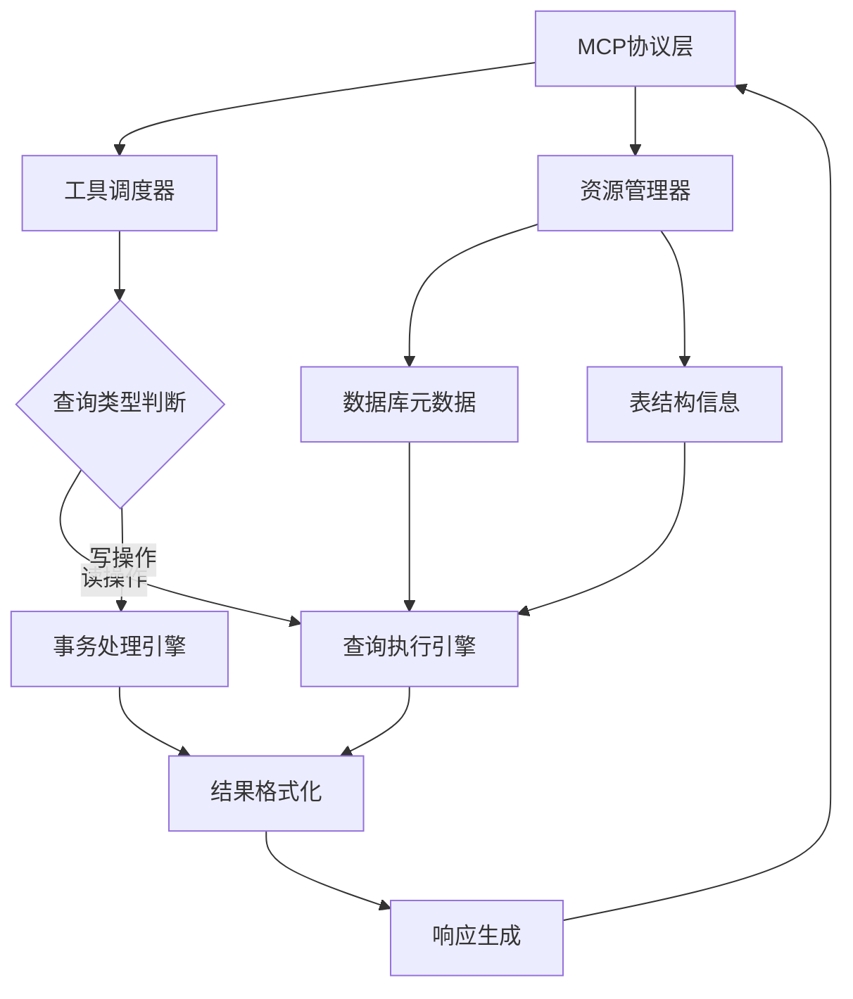
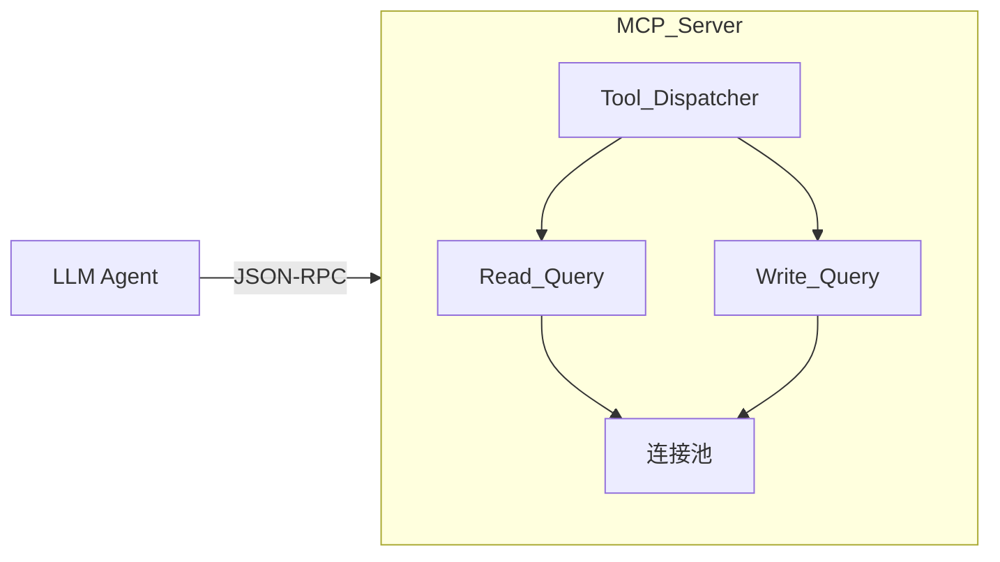
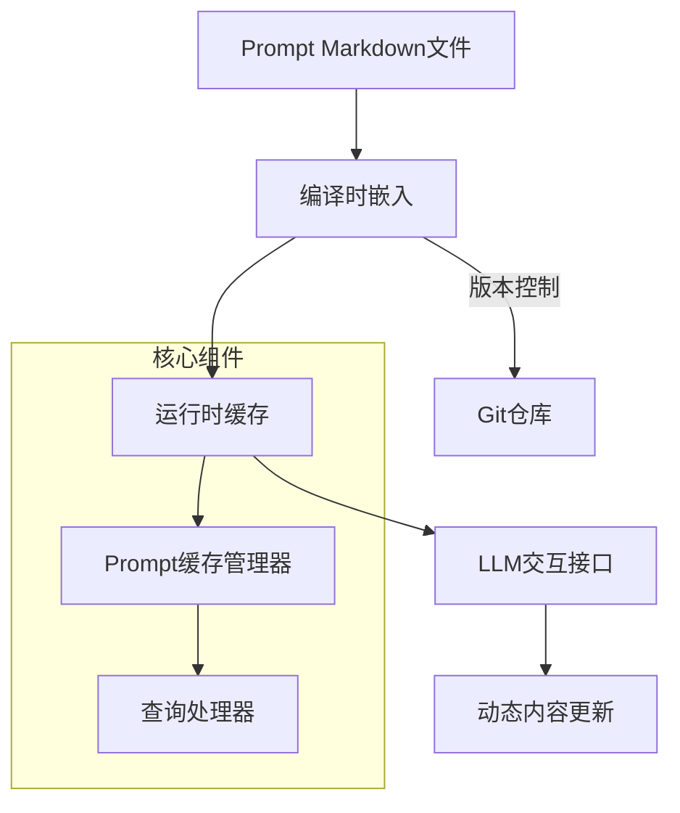
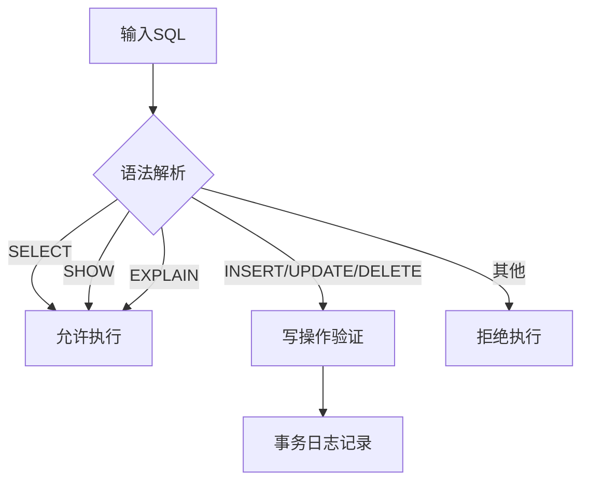
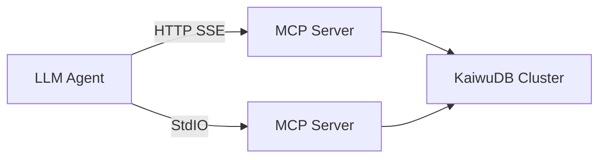

**开务数据库 MCP 服务设计文档 V1.0**


1\. **文档说明**

1.1 **术语与缩写解释**

| 术语        | 说明                                                                 |
|-------------|----------------------------------------------------------------------|
| KWDB        | 开务数据库(KaiwuDB)的开源版名称                                       |
| SSE         | Server-Sent Events，服务器推送事件协议                              |
| MCP | Model Context Protocol，模型上下文协议，用于LLM Agent与外部资源通信 |
| Prompt | 提示词，用于指导AI模型生成特定类型的回应 |
| LLM | Large Language Model，大型语言模型 |
| Agent | 智能代理，能够根据用户输入执行任务的自动化系统 |
| Tool | MCP协议提供的工具，Agent可调用的函数或服务 |
| Resource | MCP协议提供的资源，Agent可查询或订阅的数据 |


2\. **设计概述**

2.1 **架构设计**



2.2 **核心流程**
- 协议解析：处理MCP标准输入或HTTP SSE请求
- 工具路由：根据工具类型(read/write)分发处理
- 查询预处理：自动添加LIMIT、语法检查
- 连接池管理：维护数据库连接的生命周期
- 结果封装：统一JSON响应格式

3\. **功能设计**

3.1 **外部接口**

3.1.1 **MCP Tools 接口**


3.1.2 **接口定义**
1. 读查询工具：
```json
{
  "name": "read-query",
  "input": {
    "sql": "SELECT * FROM table LIMIT 10"
  }
}
```

2. 写查询工具：
```json
{
  "name": "write-query", 
  "input": {
    "sql": "INSERT INTO table VALUES(...)"
  }
}
```

3.2 **MCP Resources**
| 资源类型                | URI格式                          | 示例                          |
|-------------------------|----------------------------------|-------------------------------|
| 数据库产品信息            | kwdb://product_info  | kwdb://product_info/     |
| 数据库元信息            | kwdb://db_info/{database_name}  | kwdb://db_info/db_shig        |
| 表结构信息              | kwdb://table/{table_name}       | kwdb://table/user_profile     |

3.3 **Prompt管理架构**


3.4 **Prompt分类规范**
| 类别              | 用途说明                          | 示例提示词                  |
|-------------------|----------------------------------|------------------------------|
| 数据库描述        | 数据库功能特性说明               | db_description              |
| 语法指南          | SQL语法参考手册                  | syntax_guide                |
| 集群管理          | 节点配置与监控指南               | cluster_management          |
| 数据迁移          | 数据导入导出规范                 | data_migration              |
| 性能调优          | 查询优化策略                     | performance_tuning          |
| 故障排查          | 常见错误解决方案                 | troubleshooting             |
| 安装部署          | 环境配置指南                     | installation                 |
| DBA模板           | 管理提示词模板                   | dba_template                |


4\. **非功能性设计**

4.1 **性能设计**
- 连接池复用机制
- 查询超时控制(默认30s)
- 自动LIMIT 20保护
- 批量查询结果分页

4.2 **安全设计**


4.3 **错误处理规范**
| 错误代码       | 触发场景                  | 处理策略                     |
|----------------|---------------------------|------------------------------|
| KWDB-4001      | 语法错误                  | 返回具体错误位置             |
| KWDB-4002      | 权限不足                  | 中断执行并告警               |
| KWDB-4003      | 连接超时                  | 重试机制(最多3次)            |
| KWDB-4004      | 资源不存在                | 返回404状态码                |

5\. **部署架构**


