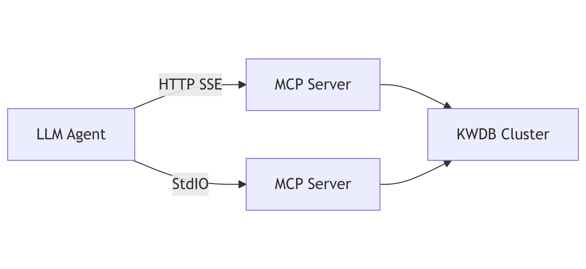
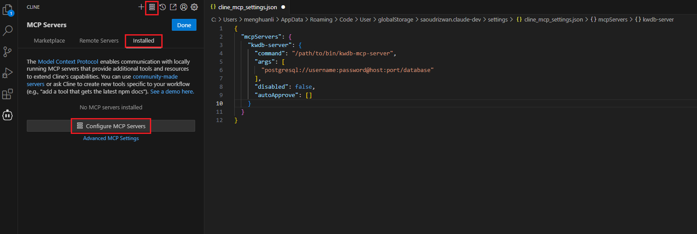

# 集成 LLM Agent

KWDB MCP Server 可与任何支持 MCP 协议的 LLM Agent 配合使用。LLM Agent 通过 HTTP SSE 传输协议或 StdIO 标准输入/输出协议连接 KWDB MCP Server，然后连接 KWDB 数据库，执行创建、插入和查询操作。

> **说明**
>
> 本节示例使用 [Cline](https://cline.bot)，但类似步骤也适用于其他兼容 MCP 协议的 LLM Agent。有关支持 MCP 协议的 LLM Agent 的详细信息，参见 [MCP 官方文档](https://modelcontextprotocol.io/clients)。



## 前提条件

- 已安装 Visual Studio Code。
- 已在 Visual Studio Code 安装 Cline 插件。
- 已[下载](https://gitee.com/kwdb/kwdb-mcp-server/releases)并解压缩 KWDB MCP Server 安装包。
- 已安装和运行 KWDB 数据库、配置数据库认证方式、创建数据库。有关详细信息，参见 [KWDB 文档官网](https://www.kaiwudb.com/kaiwudb_docs/#/oss_dev/deployment/overview.html)。
- 已创建具有表级别及以上操作权限的用户。有关详细信息，参见[创建用户](https://www.kaiwudb.com/kaiwudb_docs/#/oss_dev/deployment/bare-metal/user-config-bare-metal.html)。

## 配置 Cline 连接 KWDB MCP Server

### 标准 I/O 模式

1. 在 Visual Studio Code 右侧边栏，单击 Cline 图标。
2. 在 Cline 插件的顶部导航栏中，单击 **MCP Servers** 图标。
3. 选择 **Installed** 页签，然后单击页面底部的 **Configure MCP Servers**。

    

4. 在弹出的页面中，添加并保存 KWDB MCP Server 配置。

    ```json
    "mcpServers": {
      "kwdb-server": {
        "command": "/path/to/bin/kwdb-mcp-server",
        "args": [
          "postgresql://<username>:<password>@<host>:<port>/<database_name>"
        ],
        "disabled": false,
        "autoApprove": []
      }
    }
    ```

    参数说明：

    - `command`：指定在命令行中通过什么命令执行操作。
    - `args`：一个数组，包含传递给 `command` 的参数。
    - `username`：连接 KWDB 数据库的用户名。
    - `password`：身份验证时使用的密码。
    - `hostname`：KWDB 数据库的 IP 地址。
    - `port`：KWDB 数据库的连接端口。
    - `database_name`：需要访问的 KWDB 数据库名称。
    - `sslmode`：SSL 模式。支持的取值包括 `disable`、`allow`、`prefer`、`require`、`verify-ca` 和 `verify-full`。有关 SSL 模式相关的详细信息，参见 [SSL 模式参数](https://www.kaiwudb.com/kaiwudb_docs/#/oss_dev/development/connect-kaiwudb/java/connect-jdbc.html#%E8%BF%9E%E6%8E%A5%E5%8F%82%E6%95%B0)。

5. 选择 **Installed** 页签，单击 KWDB MCP Server 旁边的重启按钮，或者单击页面底部的 **Restart Server**。

### SSE 模式

1. 进入 KWDB MCP Server 安装目录，启动 KWDB MCP Server。

    ```bash
    ./bin/kwdb-mcp-server -t sse -p 8080 "postgresql://<username>:<password>@<host>:<port>/<database_name>?sslmode=disable"
    ```

> **注意**
> 
> SSE 模式即将弃用，建议优先使用 HTTP 模式。

参数说明：
- `-t` 或 `--transport`：传输类型，支持 `stdio`、`sse`、`http`。
  - `stdio`：标准输入/输出模式
  - `sse`：SSE 模式（即将弃用）
  - `http`：HTTP 模式（推荐）
- `-p` 或 `--port`：KWDB MCP Server 的监听端口，默认为 `8080`。
- `username`：连接 KWDB 数据库的用户名。
- `password`：身份验证时使用的密码。
- `hostname`：KWDB 数据库的 IP 地址。
- `port`：KWDB 数据库的连接端口。
- `database_name`：需要访问的 KWDB 数据库名称。
- `sslmode`：SSL 模式。支持的取值包括 `disable`、`allow`、`prefer`、`require`、`verify-ca` 和 `verify-full`。有关 SSL 模式相关的详细信息，参见 [SSL 模式参数](https://www.kaiwudb.com/kaiwudb_docs/#/oss_dev/development/connect-kaiwudb/java/connect-jdbc.html#%E8%BF%9E%E6%8E%A5%E5%8F%82%E6%95%B0)。

2. 配置 Cline 连接 KWDB MCP Server。
   1. 在 Visual Studio Code 右侧边栏，单击 Cline 图标。
   2. 在 Cline 插件的顶部导航栏中，单击 **MCP Servers** 图标。
   3. 选择 **Installed** 页签，然后单击页面底部的 **Configure MCP Servers**。
   4. 在弹出的页面中，添加并保存 KWDB MCP Server 配置。

        ```json
        "mcpServers": {
          "kwdb-server-sse": {
            "url": "http://localhost:8080/sse",
            "disabled": false,
            "autoApprove": []
          }
        }
        ```

        参数说明：
        - `url`：KWDB MCP Server 的服务地址，需要拼接 `/sse` 路径。默认值为 `http://localhost:8080/sse`。

3. 选择 **Installed** 页签，单击 KWDB MCP Server 旁边的重启按钮，或者单击页面底部的 **Restart Server**。

## 验证

以下示例假设已经创建一个名为 `lkyv_shr_cheliang_gps` 的表并写入相关数据。

在 Cline 页面，用户输入一个问题："目前有多少个异常车辆"。大模型将其转化为可执行的 SQL 语句：

```sql
SELECT COUNT(DISTINCT vehicle_name) AS abnormal_vehicle_count FROM lkyv_shr_cheliang_gps WHERE status IN ('warning', 'error') LIMIT 20;
```

运行结果如下所示：


从上图中可以看出，Cline 调取 KWDB MCP Server 的 read-query 工具，统计表中 `status` 列值为 `warning` 和 `error` 的数据。最后再由 Cline 中配置的大模型来汇总数据。
