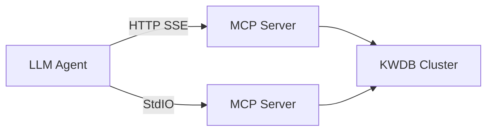
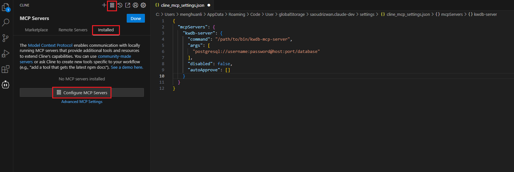
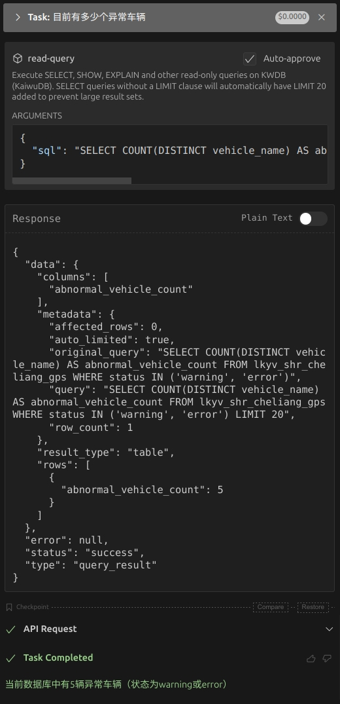

# Integrate with LLM Agents

The KWDB MCP Server can work with any LLM Agent that supports the MCP protocol. The LLM Agent connects to the KWDB MCP Server via the HTTP SSE or the StdIO transport protocol, and then connects to the KWDB database to create tables, insert and query data.

> **Note**
>
> This document uses [Cline](https://cline.bot) for an example. But these steps are also suitable for other MCP-compatible LLM Agents. For details about LLM Agents that support the MCP protocol, see the [MCP Documentation Website](https://modelcontextprotocol.io/clients).



## Prerequisites

- Install the Visual Studio Code.
- Install the Cline extension in the Visual Studio Code.
- [Download](https://gitee.com/kwdb/kwdb-mcp-server/releases) and decompress the KWDB MCP Server installation package.
- Install and start KWDB, configure the authentication method, and create a database. For details, see the [KWDB Documentation Website](https://www.kaiwudb.com/kaiwudb_docs/#/oss_dev/deployment/overview.html).
- Create a user with appropriate privileges on tables and databases. For details, see [Create Users](https://www.kaiwudb.com/kaiwudb_docs/#/oss_dev/deployment/bare-metal/user-config-bare-metal.html).

## Configure KWDB MCP Server in Cline

### StdIO Mode

1. From the left sidebar of the Visual Studio Code, click the Cline icon.
2. On the top navigation bar of the Cline extension, click the **MCP Servers** icon.
3. Select the **Installed** tab and then click **Configure MCP Servers** at the bottom of that pane. Cline will open a new settings window.

    

4. Add and save the KWDB MCP Server configurations.

    ```json
    "mcpServers": {
      "kwdb-server": {
        "command": "/path/to/bin/kwdb-mcp-server",
        "args": [
          "postgresql://<username>:<password>@<host>:<port>/<database_name>"
        ],
        "disabled": false,
        "autoApprove": []
      }
    }
    ```

    Parameters:

    - `command`: specify the coomand used to perform the operations.
    - `args`: an array, including the parameters sent to the `command` parameter.
    - `username`: the username used to connect to the KWDB database
    - `password`: the password for the username
    - `hostname`: the IP address of the KWDB database
    - `port`: the port of the KWDB database
    - `database_name`: the name of the KWDB database
    - `sslmode`: the SSL mode, available options are `disable`, `allow`, `prefer`, `require`, `verify-ca` and `verify-full`. For details about the SSL mode, see [SSL Mode Parameters](https://www.kaiwudb.com/kaiwudb_docs/#/oss_dev/development/connect-kaiwudb/java/connect-jdbc.html#%E8%BF%9E%E6%8E%A5%E5%8F%82%E6%95%B0).

5. Select the **Installed** tab and click the **Restart** button next to the KWDB MCP server you would like to restart, or click **Restart Server** at the bottom of that pane.

### SSE Mode

1. Enter the KWDB MCP Server installation directory and start the KWDB MCP Server.

    ```bash
    </path/to/bin/kwdb-mcp-server> -t sse -addr ":8080" -base-url "http://localhost:8080" "postgresql://<username>:<password>@<host>:<port>/<database_name>?sslmode=disable"
    ```

    Parameters:
    - `-t` or `-transport`: the transport type, available options are `stdio` or `sse`.
      - `stdio`: the StdIO mode
      - `sse`: the SSE mode
    - `-addr`: the listening port of the KWDB MCP Server. By default, it is set to `:8080`.
    - `-base-url` : the IP address of the KWDB MCP Server. By default, it is set to `http://localhost:8080`.
    - `username`: the username used to connect to the KWDB database
    - `password`: the password for the username
    - `hostname`: the IP address of the KWDB database
    - `port`: the port of the KWDB database
    - `database_name`: the name of the KWDB database
    - `sslmode`: the SSL mode, available options are `disable`, `allow`, `prefer`, `require`, `verify-ca` and `verify-full`. For details about the SSL mode, see [SSL Mode Parameters](https://www.kaiwudb.com/kaiwudb_docs/#/oss_dev/development/connect-kaiwudb/java/connect-jdbc.html#%E8%BF%9E%E6%8E%A5%E5%8F%82%E6%95%B0).

2. Configure the KWDB MCP Server in Cline.

    1. From the left sidebar of the Visual Studio Code, click the Cline icon.
    2. On the top navigation bar of the Cline extension, click the **MCP Servers** icon.
    3. Select the **Installed** tab and then click **Configure MCP Servers** at the bottom of that pane. Cline will open a new settings window.
    4. Add and save the KWDB MCP Server configurations.

        ```json
        "mcpServers": {
          "kwdb-server-sse": {
            "url": "http://localhost:8080/sse",
            "disabled": false,
            "autoApprove": []
          }
        }
        ```

        Parameters:
        - `url`: The service address of KWDB MCP Server with `/sse` path appended. The default value is `http://localhost:8080/sse`.

3. Select the **Installed** tab and click the **Restart** button next to the KWDB MCP server you would like to restart, or click **Restart Server** at the bottom of that pane.

## Verification

This example assumes that you have created a table (`lkyv_shr_cheliang_gps`) and inserted data into the table.

In Cline, input a question, like "How many abnormal vehicles". The LLM Agent will translate the question into an executable SQL statement:

```sql
SELECT COUNT(DISTINCT vehicle_name) AS abnormal_vehicle_count FROM lkyv_shr_cheliang_gps WHERE status IN ('warning', 'error') LIMIT 20;
```

The query results are shown as below:



From the query results, you can see that Cline calls the read-query MCP Tools in the KWDB MCP Server to query the table whose `status` column is set with values of `warning` or `error`. Then the LLM Agent configured in Cline summarizes the data.

```
```